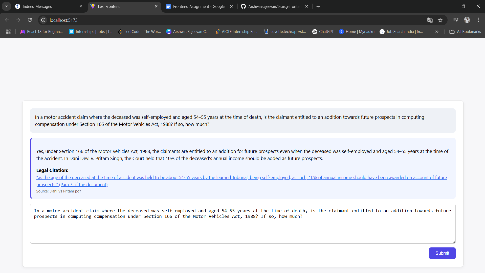

How to Run the Project
    1. Node.js and npm installed.

    2. Clone the repository
        git clone https://github.com/Arshwinsajeevan/Lexisg-frontend-intern-test.git
        cd Lexisg-frontend-intern-test
        npm install
        npm run dev

How citation linking was handled
    -When the user inputs the exact pre-defined legal question, a simulated response is shown.
    -The response includes a citation text with a hyperlink to a public PDF document.
    -The link opens the document in a new tab to simulate traceability.

Screenshot
    